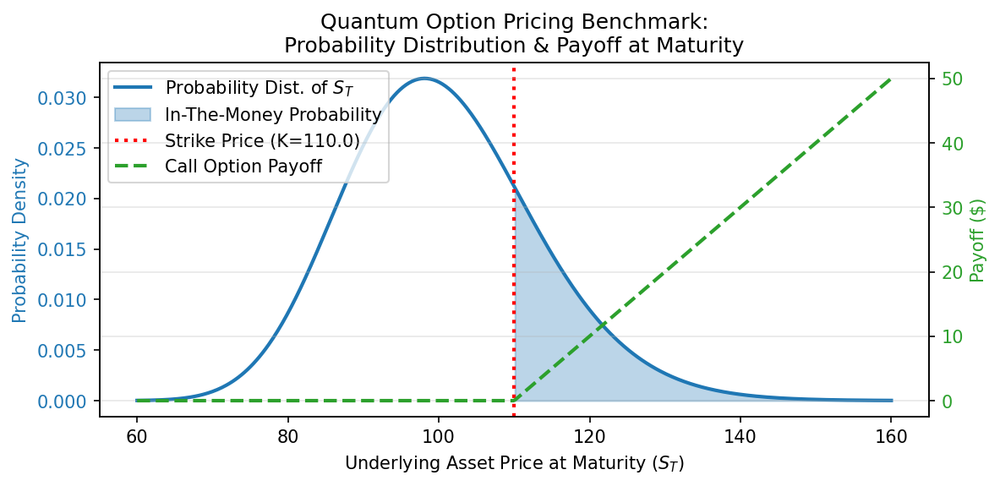
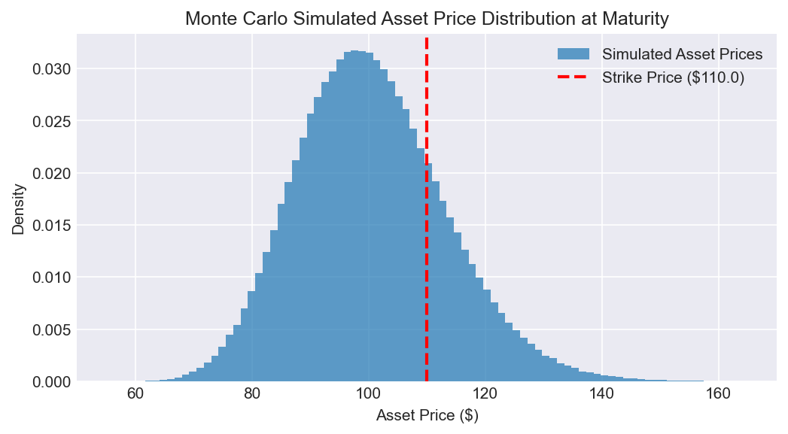
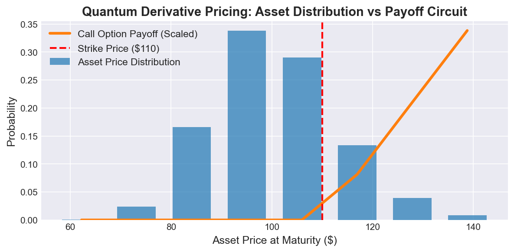

# 📊 Quantum Derivative Pricing

A hybrid classical + quantum computing project for pricing financial derivatives using traditional models and quantum algorithms such as Amplitude Estimation.

---

## 🚀 Project Overview

This project demonstrates how quantum computing can enhance financial modeling by comparing:

**Classical pricing methods:**
- Black-Scholes Model
- Monte Carlo Simulation

**Quantum approach:**
- Amplitude Estimation for faster convergence

The goal is to explore quantum advantage in derivative pricing, particularly for probabilistic simulations.

---

## 📂 Project Structure
```
Quantum-Derivative-Pricing/
│
├── classical/
│   ├── black_scholes.ipynb        # Analytical option pricing model
│   ├── monte_carlo.ipynb          # Simulation-based pricing
│
├── quantum/
│   ├── amplitude_estimation.ipynb # Quantum pricing approach
│
├── requirements.txt               # Dependencies
└── README.md                      # Project documentation
```

---

## 🧠 Concepts Used

### Classical Finance
- Black-Scholes Formula
- Risk-neutral valuation
- Monte Carlo simulations

### Quantum Computing
- Quantum circuits
- Probability amplitude encoding
- Amplitude Estimation (AE)

---

## ⚙️ Installation

**Clone the repository:**
```bash
git clone https://github.com/rupajietishere/Quantum-Derivative-Pricing.git
cd Quantum-Derivative-Pricing
```

**Create virtual environment (recommended):**
```bash
python -m venv venv
source venv/bin/activate  # Linux/Mac
venv\Scripts\activate     # Windows
```

**Install dependencies:**
```bash
pip install -r requirements.txt
```

---

## ▶️ Usage

Open any notebook directly:
```bash
jupyter notebook classical/black_scholes.ipynb
jupyter notebook classical/monte_carlo.ipynb
jupyter notebook quantum/amplitude_estimation.ipynb
```

---

## 📈 Methods Comparison

| Method | Type | Speed | Accuracy |
|---|---|---|---|
| Black-Scholes | Analytical | Fast | High (assumptions apply) |
| Monte Carlo | Classical | Slow | Improves with simulations |
| Quantum AE | Quantum | Faster (theoretical) | High |

---

## 🔬 Key Insights

- Classical Monte Carlo requires **O(N)** simulations
- Quantum Amplitude Estimation reduces complexity to **O(√N)**
- Quantum advantage becomes significant for large-scale simulations

---

## 🛠️ Tech Stack

- Python
- NumPy
- SciPy
- Qiskit / Qiskit Finance (for quantum simulations)
- Matplotlib / Jupyter

---

## 📊 Example Output

| Method | Expected Payoff |
|---|---|
| Black-Scholes | $1.8536 |
| Monte Carlo (1M paths) | $1.8492 |
| Quantum AE (3 qubits) | $2.1877 |

### Black-Scholes — Probability Distribution & Payoff


### Monte Carlo — Simulated Asset Price Distribution


### Quantum AE — Asset Distribution vs Payoff Circuit


> Convergence plots and probability distribution visualizations are generated inside each notebook.

---

## ⚠️ Limitations

- Quantum algorithms are simulated (no real quantum hardware)
- Low qubit count (3 qubits = 8 discrete price levels) introduces discretization error (~20% in current results)
- Noise and hardware constraints not fully modeled
- Requires understanding of both finance and quantum computing

---

## 🔮 Future Improvements

- Increase qubit count for better pricing accuracy
- Integration with real quantum hardware (IBM Q)
- Support for exotic options
- Variance reduction techniques
- Hybrid quantum-classical optimization

---

## 🌟 Get Involved

Contributions are welcome! Feel free to fork the repo and submit a pull request.

---

## 📜 License

This project is licensed under the MIT License.

---

## 🤝 Connect with Me
[](https://www.linkedin.com/in/rupajiet-bhattacharjee-60932769)  
[](https://github.com/rupajietishere)