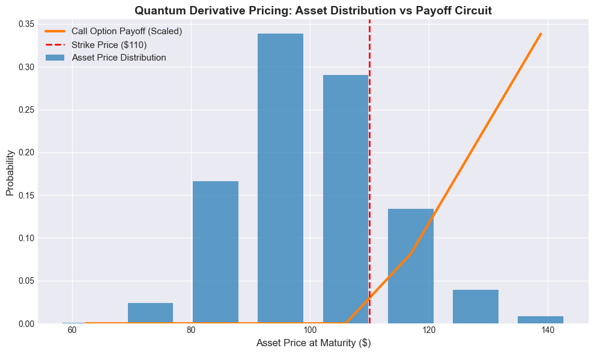

# ⚛️ Quantum Derivative Pricing via Amplitude Estimation


## 📌 Project Overview
In Quantitative Finance, pricing complex financial derivatives relies heavily on **Monte Carlo (MC) simulations**. However, classical MC simulations converge at a slow rate of $\mathcal{O}(1/\epsilon^2)$. This means to achieve 10x more accuracy, an investment bank needs 100x more computational power. 

This project explores how **Quantum Computing** can solve this bottleneck. By utilizing **Iterative Quantum Amplitude Estimation (IAE)**, we model a European Call Option to achieve a theoretical **quadratic speedup**, yielding a convergence rate of $\mathcal{O}(1/\epsilon)$.



---

## 🧠 The Mathematics & Quantum Architecture

### 1. The Uncertainty Model (Asset Price)
Unlike classical computers that generate sequential random paths, a quantum computer can evaluate an entire probability distribution simultaneously in **superposition**. 
* We map a continuous **Log-Normal distribution** representing future asset prices into a discrete quantum state using $n$ qubits (where $n=3$, yielding $2^3 = 8$ discrete probability states).

### 2. The Payoff Circuit
The payoff for a European Call Option is strictly non-linear: $\max(0, S_T - K)$.
* We construct a piecewise linear quantum circuit to represent this payoff function, scaled specifically to be evaluated via quantum phase estimation.

### 3. Iterative Amplitude Estimation (IAE)
Instead of canonical Quantum Amplitude Estimation (which requires many auxiliary qubits), we use IAE. IAE relies entirely on Grover iterations, making it highly optimized and suitable for the **NISQ (Noisy Intermediate-Scale Quantum)** era.

---

## ⚙️ Tech Stack & Implementation Highlights
* **Language:** Python
* **Quantum Framework:** IBM Qiskit (1.0 Architecture)
* **Libraries:** `qiskit-finance`, `qiskit-algorithms`, `numpy`, `matplotlib`

### 💡 Technical Challenge: Qiskit 1.0 Migration
This project was built using the latest **Qiskit 1.0** framework. During development, the `qiskit-algorithms` module required migration from V1 to V2 Primitives. To successfully execute the Iterative Amplitude Estimation, this project implements the V2 `StatevectorSampler` and modern **PUB (Primitive Unified Bloc)** execution formats.

---

## 🚀 Installation & Usage

## Prerequisites
It is highly recommended to run this project inside a Python Virtual Environment to prevent dependency conflicts with global packages.

```bash
# 1. Clone the repository
git clone https://github.com/rupajietishere/quantum-derivative-pricing.git
cd quantum-derivative-pricing

# 2. Create and activate a virtual environment
python -m venv venv
source venv/bin/activate  # On Windows use: venv\Scripts\activate

# 3. Install dependencies
pip install -r requirements.txt
```

### Running the Jupyter Notebook
To view the code, math, and interactive charts, launch Jupyter Notebook:

```bash
jupyter notebook quantum_pricing.ipynb
```

## 📊 Results & Analysis

| Metric | Value |
| :--- | :--- |
| **Initial Spot Price ($S_0$)** | $100.00 |
| **Strike Price ($K$)** | $110.00 |
| **Classical Exact Expected Payoff** | $1.8578 |
| **Quantum Estimated Payoff** | $2.3089 |
| **Estimation Error** | $0.4512 |

**Why the $0.45 error?**
The divergence between the classical baseline and the quantum estimation is a known **discretization error**...

---

## 🔮 Future Scope

* **Exotic Options:** Expanding the quantum circuit to price path-dependent options (e.g., Asian or Barrier Options).
* **Real Hardware:** Porting the circuit from the local `StatevectorSampler` to actual IBM Quantum hardware.
* **Risk Management:** Implementing Quantum algorithms for calculating "The Greeks" (Delta, Gamma).

## 🤝 Connect with Me
[](https://www.linkedin.com/in/rupajiet-bhattacharjee-60932769)  
[](https://github.com/rupajietishere)